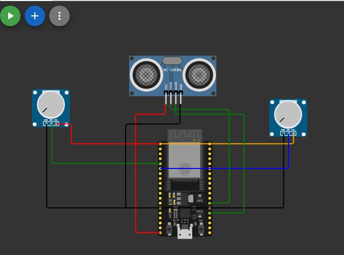
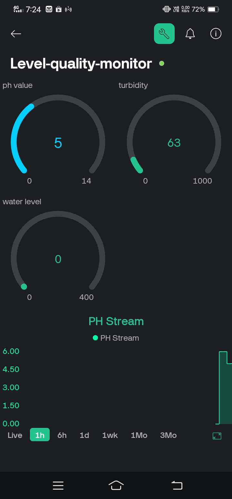
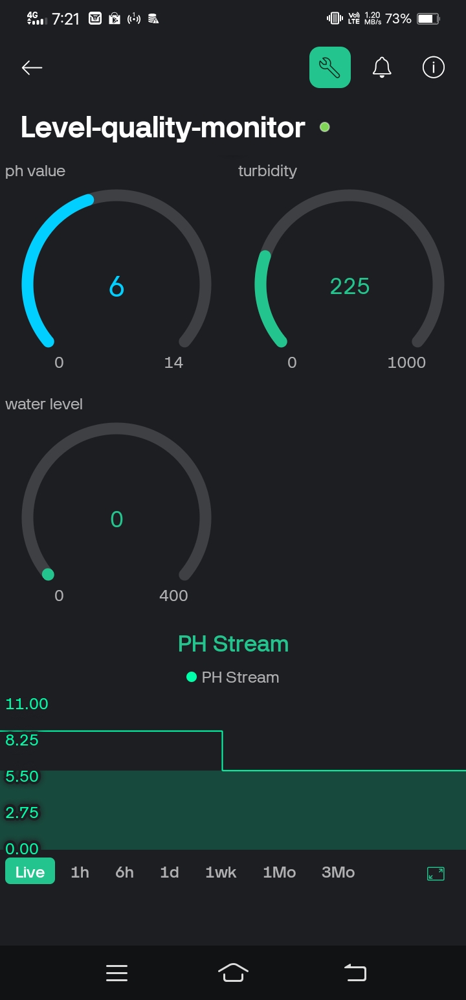

## Project Overview
- **Tech Stack used:** c++, javascript, react native, firebase
- **Software Components used:** VS code, Ardiuno IDE Blynk Cloud and Wokwi
- **Hardware Components Used:** ESP32 Microcontroller, turbity sensor, ph sensor, ultrasonic sensor, Lithium ion Battery, DC buck to Buck converter, LED display

## Objective
Access to clean and safe drinking water is a fundamental necessity, and contamination of water sources can lead to severe health issues. This system utilizes water quality sensors to detect contaminants, pH levels, turbidity, and other parameters. Additionally, water level sensors ensure efficient management of supply, preventing shortages or overflows. By collecting and analyzing real-time data, This system can issue alerts to authorities and the general public when quality standards are compromised.

## Project Goals
- **Ensure Safe Drinking Water**: Detect contaminants, pH levels, turbidity, and other harmful elements.
- **Monitor Water Levels**: Prevent shortages and overflows by tracking tank levels.
- **Provide Instant Alerts**: Notify authorities and residents through an app when water quality is compromised.
- **IoT Integration**: Enable seamless connectivity for real-time data access.
- **Future Enhancements**: Expand capabilities with predictive analytics, AI-powered contamination detection, and automated corrective measures.

## How It Works
1. **Sensors Gather Data**: Various sensors collect real-time water quality and level information.
2. **Data Processing**: The system analyzes sensor data to identify contamination risks.
3. **Alert System**: If water quality is poor, alerts are sent via an app, SMS, or web notifications.
4. **User-Friendly Interface**: The app enables residents, rural areas and officials to monitor water status remotely.

## Project Impact
- **Prevention of Waterborne Diseases**: Early warnings reduce health hazards.
- **Efficient Water Management**: Helps optimize supply and distribution.
- **Community Engagement**: Increases awareness and promotes proactive water conservation efforts.

## Simulation Screenshot
Here’s an image of the project simulation:

## Live Data

